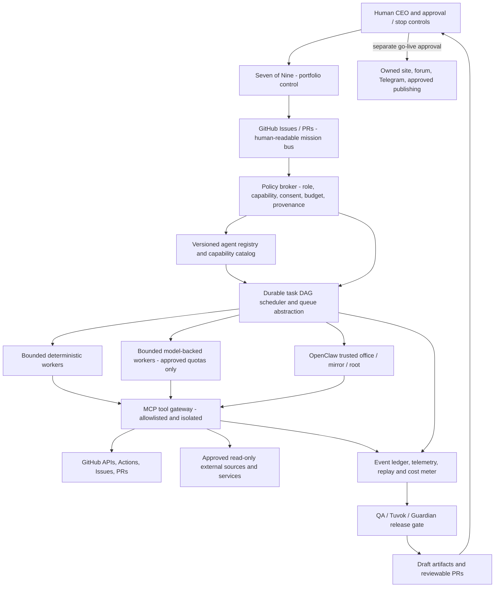

# QuantDeus Galactic Industries — STAR EMPIRE Company Architecture v1.0

**Status:** PROPOSAL / design-only · **Date:** 2026-10-10 · **Owner:** Human CEO · **Execution leader:** Seven of Nine · **Technical architect:** Lt. Cmdr. Data  
**Canonical repo:** `quantdeus/quantdeus.github.io` · **Parent epic:** [#554](https://github.com/quantdeus/quantdeus.github.io/issues/554) · **Agent embassy:** [#552](https://github.com/quantdeus/quantdeus.github.io/issues/552)

> **Mission:** Build an AI-native engineering and product holding with SpaceX-like systems engineering, ruthless testing, fast iterations, and a human-controlled mission. Start with the existing 27 real registered agents and develop a capacity model for up to **10,000 logical agent profiles**, not 10,000 simultaneously running LLMs, bots, accounts, posts, or paid invocations. Incremental cash budget = **0 RUB unless explicitly reauthorized by CEO**.

## 1. Company operating system: one holding, six missions

QuantDeus is the holding / governance / brand / technical platform. Individual missions own their product P&L hypothesis, tests, releases, and measurable outcomes.

| Mission / program | Product artifacts | Outcome measured |
|---|---|---|
| QD-AI / Business Automation | reusable MCP integrations, automation demos, customer pilots | useful demos, qualified inbound requests, paid approved pilots |
| QD-Space / Advanced Propulsion | evidence maps, reproducible calculations, research prototypes | validated assumptions, reproducible test results |
| QD-Energy / Ecology | open science prototypes, data reports and simulation models | empirical validation and practical impact |
| QD-Games / Interactive | game tools, launchers and Android/WebGL experiments | playable builds, QA pass rate, install success |
| QD-Media / Cultural Studio | creator pages, approved artist products and media | attributable opt-in interest and legitimate bookings |
| QD-Community / Education | docs, public forum, tutorials, accessible portal | first meaningful contribution, retention, user satisfaction |

Every mission must have **an accountable human owner**, a success metric, a kill criterion, and a weekly artifact. No fabricated success or fake customer claims.

## 2. Organizational hierarchy and decision rights

| Level | Entity | Responsibility | Authority |
|---|---|---|---|
| L0 | Human CEO / mission board | Vision, budgets, contracts, public commitments, external representation | Final approval and global kill switch |
| L1 | Seven of Nine, Human Override | Intake, resource arbitration, weekly portfolio, cross-swarm priorities | Assign internal tasks; cannot expand permissions |
| L2 | Data / Strategic Hub / EMH | Architecture, metrics, incident hygiene, dependency mapping | Recommend; reversible internal operations |
| L3 | Mission Directors | Own per-program backlog and evidence of progress | Operate inside approved budgets and policies |
| L4 | Chiefs of Platform, R&D, Product, QA, Growth | Own specialized worker pools, protocols and SLOs | Limited departmental capabilities |
| L5 | Worker identities / micro-agents | Execute single bounded jobs | Time-limited, scoped tool permissions |

**Existing first-class leaders:** Seven of Nine coordinates; Data owns the registry and scheduling specification; Sherlock owns verification and research; Tuvok checks epistemic integrity; Guardian owns tool authority; EMH handles loop pressure and conflict; QA-syntax/QA-contract/QA-repair guard releases. **Keep all current agent IDs and scripts** (see `coordination/agents.json`, `coordination/startup-org.json`). Do not replace 27 genuine records with 10,000 claims of live workers.

### Planning-only 10,000 logical identity allocation (not funded positions or workloads)

| Worker family | Registry slots |
|---|---:|
| Command, planning, systems integration | 100 |
| Space, energy, research and evidence | 2,000 |
| Engineering, apps, DevEx and product prototyping | 2,400 |
| QA, security, red-team and reliability | 1,400 |
| Data, knowledge, provenance, documentation | 1,200 |
| Growth, publishing **drafts**, SEO and market research | 1,000 |
| Operations, integrations and platform | 1,000 |
| Community service and education | 900 |
| **TOTAL CAPACITY** | **10,000** |

Virtual worker record ≠ instantiated process ≠ model invocation ≠ account ≠ external activity. Enforce separate `registered_count`, `eligible_count`, `leased_count`, `running_count`, and `verified_deliverables_count` in all reports.

## 3. System-of-systems architecture



**Three planes:**
1. **Control plane:** strategy, approvals, identity registry, policy, scheduling, portfolio. GitHub Issues = management interface, **not** a high-throughput 10k-job queue.
2. **Execution plane:** short-lived job workers (deterministic by default, model calls only on approved quota); MCP tools and optional A2A adapters; OpenClaw where it already runs with explicit trusted lanes.
3. **Evidence plane:** artifacts, tests, observability, provenance, cost and performance, incident response. Nothing is marked VERIFIED without a link, SHA, log, test, screenshot or trace.

**MCP and A2A are complementary.** MCP connects an executor to scoped tools and data; A2A is an optional inter-agent transport, not required for V0. Adopt 2026-07-28 MCP core semantics and current authorization protections: https://modelcontextprotocol.io/specification/2026-07-28 ; A2A: https://github.com/a2aproject/A2A .

## 4. Technical modules: smallest composable implementation

Planned paths (no claim these are already implemented):

```text
coordination/mesh/
  agent.schema.json            # single logical role / identity / capability
  agents.generated.jsonl       # 10k virtual identities only in test fixtures
  task.schema.json             # task id, DAG edges, lineage, priority, risk
  policy.json                  # declared permissions and approvals
  company-missions.json        # mission objectives, owners, metrics, stop tests
scripts/mesh/
  registry.mjs                 # load/validate, lookup by capability
  dispatch.mjs                 # select candidates; budget and WIP gates
  worker.mjs                   # bounded deterministic action lifecycle
  broker.mjs                   # deny-by-default tool access
  ledger.mjs                   # append-only, secret-redacted event records
  report.mjs                   # actual active vs logical counts
tests/mesh/
  registry.spec.mjs
  dispatch.spec.mjs
  broker.spec.mjs
  chaos.spec.mjs
docs/agent-mesh/
  STAR_EMPIRE_COMPANY_ARCHITECTURE.md
  PLATFORM_MATRIX.md
  COST_MODEL.md
  THREAT_MODEL.md
  RUNBOOK.md
```

**Data model (proposed):**

```json
{
  "agent_id": "qd.engineering.webgl.000042",
  "parent_template": "webgl-engineer",
  "division": "product-engineering",
  "capabilities": ["code.review", "patch.draft"],
  "allowed_tools": ["github.read", "github.pr.draft"],
  "authority": "propose-only",
  "status": "registered",
  "risk_tier": "low",
  "budget_tokens": 0,
  "max_runtime_seconds": 120,
  "max_child_tasks": 2,
  "human_owner": "CEO",
  "created_by": "registry-generator-v1"
}
```

The example is a **proposed schema**, not a statement that a live WebGL engineer is active. All IDs must be unique and validated; registry entries with invalid capabilities must fail closed.

### Task state machine

`PROPOSED → TRIAGED → APPROVED → QUEUED → LEASED → RUNNING → VALIDATING → COMPLETE`  
Alternatives: `BLOCKED, WAITING_HUMAN, RETRY_BACKOFF, DEAD_LETTER, CANCELLED`.

Task fields: UUID, mission_id, issue/pr refs, agent identity, capabilities, `idempotency_key`, dependencies, deadline, lease owner/expiry, attempt count, retry-after, budget ceiling, evidence references, `approved_by`, `outbound_scope`. Transitions are checked and logged.

**Dispatch policy:** bounded WIP; weighted fair queue by mission; explicit DAG cycle detection; max depth 3; max child jobs 2 per parent in V0; lease expiration; retry max 2 with exponential backoff+jitter; dead-letter; dedupe by idempotency key; pause on quota or policy uncertainty; worker timeouts; no recursive self-replication.

**Persisted state caveat:** ephemeral GitHub Actions runners cannot be the sole durable SQLite/queue host. For V0 keep GitHub management state plus reviewable local/single-writer test fixtures; if a genuinely durable always-on executor is available, put transactional SQLite on persistent storage. For company-scale high throughput, migrate behind a storage interface to Postgres and a real queue (NATS JetStream/Redis Streams/etc.) **only after** runtime, operation costs and access are approved. Never fake persistent queue guarantees using CI artifacts.

## 5. Tool adapters and security boundaries

- GitHub adapter: minimal-scoped `GITHUB_TOKEN` or a least-privileged GitHub App; read-only default; branches/PRs instead of direct `main` commits. Follow #421 authority broker.
- MCP gateway: verified local/server endpoints, capability allowlist, scope-bound tokens, HTTPS/OAuth when appropriate, origin isolation; network and file allowlists; no arbitrary remote `skill.md` execution.
- Optional Claude/Composio/model adapter: **discovery is not entitlement**. Explicit provider quota and cost verification required before real inference; zero-token mocked worker is the required baseline.
- Optional A2A adapter: signed/authorized peers, timeout, identity and endpoint verification, message size and fanout caps; untrusted peer content never becomes system authority.
- Outbound connector: separate approval per channel, owned account, consent or native platform permission, attribution, posting cap, opt-out and audit. **No unsolicited bulk DMs, fake engagements, impersonation, mass account creation, scraping prohibited sources, or bypassing provider limits.**
- Human-only: financial commitments, contracts, paid plans, permission upgrades, external diplomacy and public statements of authority, production deploy/WordPress changes.

Security cases to test: prompt injection from fetched HTML/MCP descriptions; malicious instruction in issue body; SSRF; exfiltration attempt; credentials in logs; role escalation; forged agent identity; retry storm; duplicate tasks; stale approvals; external agent compromised; root/mirror feedback loop.

## 6. Models and execution cost ladder

| Priority | Execution route | Budget stance |
|---|---|---|
| 1 | deterministic Node/Python scripts, parsers, linters, existing rule-based agents | no inference cost |
| 2 | GitHub Actions for bounded build/test events in public repo | currently free for standard runners, **subject to rate/concurrency/service limits** |
| 3 | local open-weights model via llama.cpp/Ollama on **already available hardware** | software may be free; electricity and finite hardware remain real costs |
| 4 | existing authorized cloud models (Claude via Composio or otherwise) | use **only verified free remaining quota**; strict hard stop |
| 5 | paid inference, cloud queues/databases, extra runners | gated; **do not enable under 0 RUB policy** |

As of 2026-10-10 GitHub docs note **20 simultaneous standard hosted jobs on Free** and repo `GITHUB_TOKEN` API limit generally **1,000 requests/hour per repository**; authenticated user REST API generally **5,000 requests/hour**. Public-repo standard hosted Actions runner compute is free, not infinite, nor a substitute for a 24/7 server. Re-check limits via response headers and docs, never attempt evasion:
- https://docs.github.com/en/actions/reference/limits
- https://docs.github.com/en/rest/using-the-rest-api/rate-limits-for-the-rest-api
- https://docs.github.com/en/billing/concepts/product-billing/github-actions

Budget enforcer = hard max spend **0 RUB incremental**, max cloud tokens **0** unless proven free and authorized, max model attempts, max concurrent runs, API headroom reserve. If provider reports unknown/free balance: **PAUSE**, not fallback to paid.

## 7. SpaceX-style product delivery: mission pods + flight gates

Each project decomposes into a **mission pod** containing 5–9 role assignments, reusing workers rather than minting permanent new personalities:

```text
MISSION INTAKE
  ↓ evidence and measurable goal (Sherlock / product)
DESIGN REVIEW [DR0] - assumptions, system boundaries, costs (Data / Tuvok)
  ↓ bounded task DAG (Seven)
PROTOTYPE [DR1] - separate branch, testable artifact (engineering)
  ↓ integration tests, security, budget, rollback (Guardian + QA)
FLIGHT READINESS [DR2] - actual measurements, owner approval
  ↓ approved launch to one channel / one cohort / one reversible change
POST-FLIGHT [DR3] - error budget, feedback, actual conversion and incidents
  ↓ iterate / stop / archive
```

Mandatory per-task outputs: source SHA, test result, risks, actual cost/tool calls, reproducible steps, next action. Stop a pod after two non-improving repair cycles until Seven/EMH diagnoses it. No loop that burns through Actions indefinitely.

**Business flywheel:** public useful demo → SEO/tutorial → opt-in conversation → scoped free diagnosis → quote and human contract approval → paid authorized pilot → documented reusable tool → open-source credibility → next inbound. Marketing agents create honest drafts and research, not spam.

## 8. Four rollout horizons with acceptance tests

### Phase 0 — Architecture and inventory (existing epic #554)
- [ ] Verify current agents, trust boundaries, GitHub workflows and available connectors; tag VERIFIED/ASSUMED.
- [ ] Cross-link #552, #421, #547, #505, #417. Avoid duplicate projects.
- [ ] Approve role taxonomy, schemas, `PLATFORM_MATRIX.md`, `COST_MODEL.md`, threat model. No external write or paid execution.
- [ ] **Exit:** reviewable architecture PR, CEO acknowledgment, no production changes.

### Phase 1 — 27 → 100 logical roles, 5–10 mock executors
- [ ] Implement registry validation and task state machine; one issue-to-task-to-result path.
- [ ] Implement authority broker + denial tests, event ledger, retry/dedupe/dead letter, hard stop.
- [ ] Deliver one useful internal demo from QD-AI, fully testable.
- [ ] **Exit:** 100 fixtures validate, at most 3 simultaneous workers, 0 external inference calls, 0 RUB incremental spend, policy tests green.

### Phase 2 — 100 → 1,000 virtual identities
- [ ] Add mission-based fair dispatch, metrics dashboard, resource measurements, cross-swarm loop guards.
- [ ] Exercise fault injection for queue failure, timeout, API 403/429, invalid MCP output and replay.
- [ ] **Exit:** reproducible synthetic workload and bounded memory/CPU/API; proof not screenshots of imaginary workers.

### Phase 3 — 1,000 → 10,000 **registered identities**
- [ ] Generate/validate 10k registry records without 10k live API/model calls.
- [ ] Capacity test queue DAG and indexed lookup; optionally graduate queue backend only with budget approval.
- [ ] **Exit:** recorded wall-clock, memory, CPU, failures, true peak concurrency, zero unintended outbound activity and spend; test data tagged SIMULATED.

### Phase 4 — Validated products and external growth
- [ ] First get explicit CEO approval for each account integration and live publishing lane.
- [ ] Trial one approved account/channel and one genuinely useful reviewed contribution; measure real opt-in inquiries.
- [ ] Expand only if value, budget, terms, and operational reliability justify it.
- [ ] **Exit:** evidence of real users and useful artifacts, not raw bot volume or followers.

## 9. Management dashboard: what CEO actually sees

| Signal | Precise meaning |
|---|---|
| 27 canonical leaders | currently documented identities in `agents.json`, not verified concurrent compute |
| Registered logical workers | entries in registry |
| Leased/running workers | proven live process or approved inference execution |
| Delivered outcomes | merged approved PRs, reproducible research, published owner-approved artifacts |
| Queue SLA | median/p95 time to completion and age of blocked work |
| Reliability | green CI rate, duplicate work, retry exhaustion, security denials |
| Budget | actual paid spend, actual model/tool calls, remaining quota, estimated infra cost |
| Business | qualified opt-in leads, accepted pilots, attributable retained users, paid receipts |
| Safety | incidents, approvals awaiting CEO, attempted unauthorized outbound actions |

One daily Seven of Nine report: **main SHA, known active jobs, blocker count, up to three next actions, zero/actual spend, verified deliverables and links**. Distinguish simulations, plans and production. No claims of 24-hour activity without execution logs.

## 10. The first three small PR-sized tasks for the monkeys

**STAR-01 (Data + Guardian)** — implement JSON schema + 100 logical fixtures with unit tests. Done when validation checks uniqueness, agent parent, permissions and no unauthorized tool access.

**STAR-02 (Seven + tasksmith + QA)** — implement dry-run GitHub Issue → validated task DAG → bounded scheduler → mock worker → ledger. Done when a replay does not duplicate results and 403/429 pauses safely.

**STAR-03 (Sherlock + Tuvok + Growth)** — research official MCP/A2A/Actions pricing and approved channels; deliver PLATFORM_MATRIX/COST_MODEL + one useful QD-AI demo/tutorial in draft. Done when every externally sourced claim has a citation and outbound stays disabled.

**Dependency order:** STAR-01 → STAR-02 → STAR-03 approval review. Parallel research is allowed with scoped read-only permissions. Split files/review ownership to prevent PR conflict.

## 11. Governance and no-touch production agreement

- This document is **design only**. Do not deploy 10,000 agents, register social accounts, expand privileges, spend funds, edit production WordPress, merge to main, bypass branch protection or modify payments.
- Existing QuantDeus production infrastructure, OpenClaw webhook-only Telegram route, and user login remain unchanged.
- Human approvals must be observable, bound to task IDs and expire. No model-generated message counts as a valid permission grant.
- Public contribution and any first-contact/diplomacy representation remain human-led.
- The purpose is **more useful, validated engineering per ruble and hour**, not agent count as a vanity target.

## 12. Source references and related work

- QuantDeus [10k epic #554](https://github.com/quantdeus/quantdeus.github.io/issues/554) and [agent networks reconnaissance #552](https://github.com/quantdeus/quantdeus.github.io/issues/552)
- [MCP specification (2026-07-28)](https://modelcontextprotocol.io/specification/2026-07-28)
- [MCP authorization](https://github.com/modelcontextprotocol/modelcontextprotocol/blob/main/docs/specification/2026-07-28/basic/authorization/index.mdx)
- [A2A protocol](https://github.com/a2aproject/A2A)
- [LangGraph open-source orchestration](https://github.com/langchain-ai/langgraph)
- [GitHub Actions limits](https://docs.github.com/en/actions/reference/limits), [GitHub API limits](https://docs.github.com/en/rest/using-the-rest-api/rate-limits-for-the-rest-api), [GitHub Actions billing](https://docs.github.com/en/billing/concepts/product-billing/github-actions)

**Owner decision requested after review:** approve only Phase 0/Phase 1 implementation scopes via explicit issue/PR commands; outward activation and model billing remain disabled.
